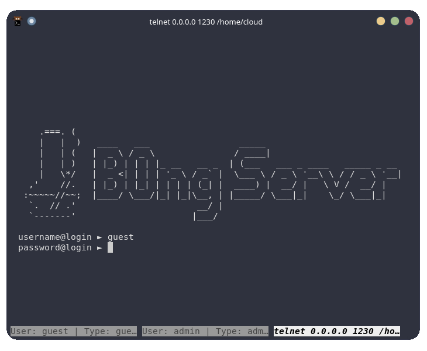
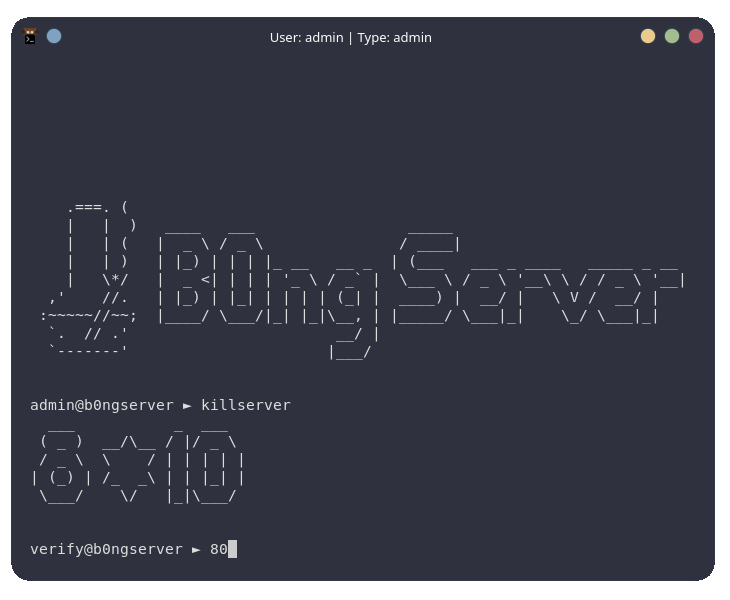
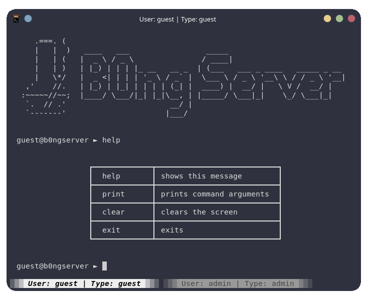
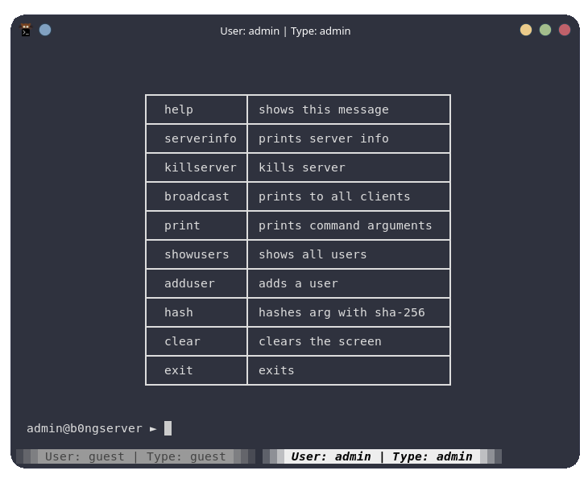
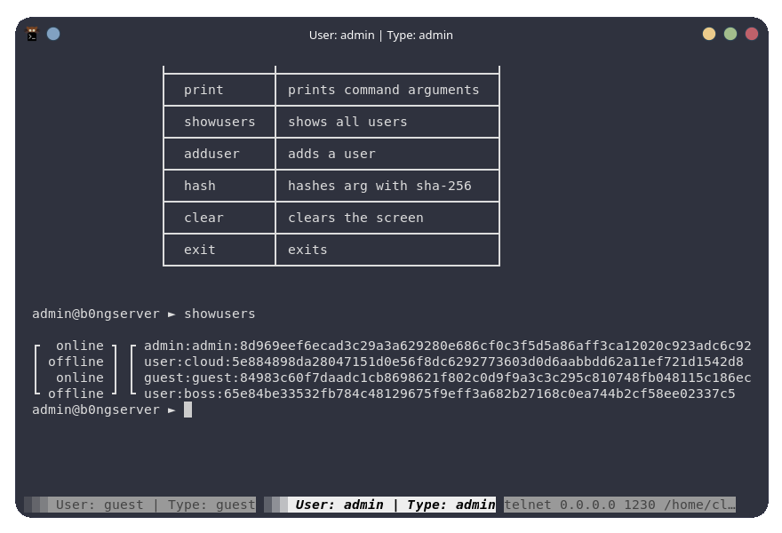
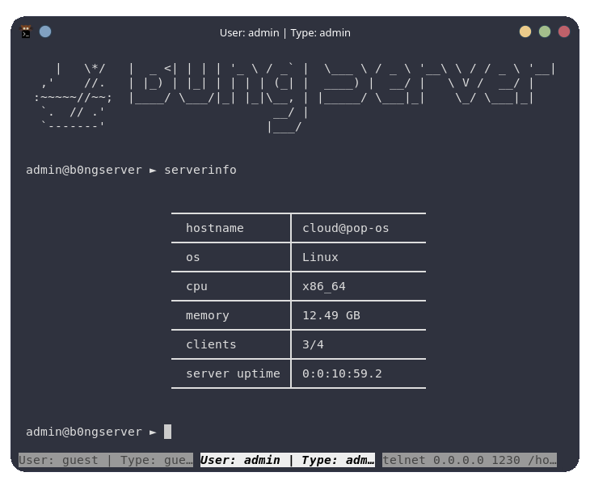

<p align="center">
  
</p>
<div align="center">
  <h1>B0ng Server</h1>
</div>


> # configuration via json
> ```json
>{
>    "_info_": "use auto for autofill",
>    "HOST": "auto",
>    "PORT": 1111,
>    "BYTERATE": 1024,
>    "PREFIX": "",
>    "PROMPT": "\n!username@b0ngserver ► ",
>    "V_PROMPT": "\nverify@b0ngserver  ► ",
>    "LOGIN_PROMPT": "auto"
>  }
>```

> # Login System
> 
>> ```python
>>  # called with
>>  send_login(client_socket, client_address)
>>  # example usage
>>  getuser = send_login(client_socket, client_address)
>>  if getuser: 
>>    usertype, username, password = getuser.split(":")
>> ```
> # Captcha
> 
>> ```python
>>  # called with
>>  verify(client_socket)
>>  # example usage
>>  if verify(client_socket):
>>    send_data(f"Processing data: {arg}", client_socket)
>>    # processing
>>  else:
>>    send_data(f"Failed Captcha", client_socket)
>> ```
>### User
> 

> # Admin
> 
>>  # showusers
>> 
>>  # serverinfo
>> 